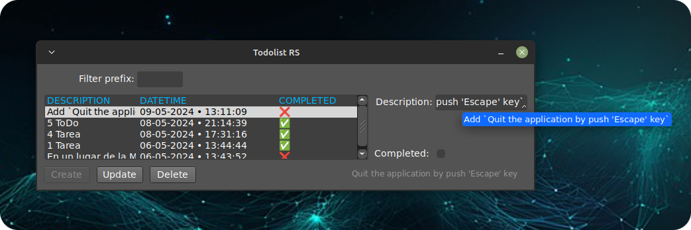

<div align="center">
  
<h1 align="center">rust-fltk-todolist</h1>


<hr />

<p style="margin-bottom: 16px;">
    Rust/fltk-rs desktop demo application that uses the <a href="https://github.com/fltk-rs/fltk-rs">fltk-rs</a> GUI framework and persists data in a database-like binary file, performs a full CRUD, and displays a to-do list in GUI.
</p>

<br />
  
  

</div>

<hr />

>🤦 Yes, just another to-do application, but to try something new you have to start somewhere ¯\\\_(ツ)\_/¯.

### 🤔 Explanation

`fltk-rs` is a Rust bindings for the [FLTK](https://www.fltk.org/) Graphical User Interface library.

The `fltk crate` is a cross-platform lightweight gui library which can be statically linked to produce small, self-contained and fast gui applications.

Why choose `FLTK`?
- Lightweight. Small binary, around 1mb after stripping. [Small memory footprint](https://szibele.com/memory-footprint-of-gui-toolkits/).
- Speed. Fast to install, fast to build, fast at startup and fast at runtime. 
- Single executable. No DLLs to deploy.
- Supports old architectures. 
- `FLTK`'s permissive license which allows static linking for closed-source applications.
- Themeability (5 supported schemes: Base, GTK, Plastic, Gleam and Oxy), and additional theming using [fltk-theme](https://crates.io/crates/fltk-theme).
- Provides around 80 customizable widgets. 
- Has inbuilt image support.

Here is a [list](https://en.wikipedia.org/wiki/FLTK#Use) of software using FLTK. For software using fltk-rs, check [here](https://github.com/fltk-rs/fltk-rs/issues/418).

- [Link](https://github.com/fltk/fltk) to the official FLTK repository.
- [Link](https://www.fltk.org/doc-1.4/index.html) to the official documentation.

#### `Fluid`

`FLTK` offers a GUI WYSIWYG rapid application development tool called FLUID which allows creating GUI applications. Currently there is a video tutorial on [youtube](https://www.youtube.com/watch?v=k_P0wG3-dNk) on using it with Rust: Use `FLUID` (RAD tool) with Rust (more info [here](https://fltk-rs.github.io/fltk-book/Fluid.html)).

#### Resources:
- [Book](https://fltk-rs.github.io/fltk-book/)
- [Documentation](https://docs.rs/fltk)
- [Videos](https://www.youtube.com/playlist?list=PLHqrrowPLkDu9U-uk60sGM-YWLOJFfLoE)
- [Examples](https://github.com/fltk-rs/fltk-rs/tree/master/fltk/examples)
- [Demos](https://github.com/fltk-rs/demos)
- [7guis-fltk-rs](https://github.com/tdryer/7guis-fltk-rs)
- [FLTK-RS-Examples](https://github.com/wyhinton/FLTK-RS-Examples)
- Erco's FLTK cheat [page](http://seriss.com/people/erco/fltk/), which is an excellent FLTK C++ reference.

#### Conclusion:

Use this library if you want something very, very light, quick to code and compile... and you like somewhat minimalist interfaces like me.🤓

### 👨‍🚀 Getting Started

#### Run the application:

Install the Rust toolchain and run the following command in the root directory of the project:

```bash
cargo run
```

#### 🖼️ Screenshot

<div align="center">

###### Application window showing pop-up corresponding to the description of an item in the ToDo list:



</div>

#### Create an app bundle (`.deb` file & executable binary for MacOS/Linux):

Run the following command at the root of the project (it is necessary to have installed [`cargo bundle`](https://crates.io/crates/cargo-bundle) in the system using `cargo install`):

```bash
cargo bundle --release
```

>[!NOTE]
>***On Linux, if you install the application using the `.deb` file, a `.todo.dat` file will be generated in the user folder. We can establish the path of said file if we edit the application's preferences from its launcher.***


### Happy coding 😀!!